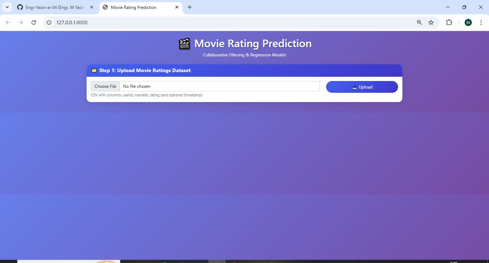
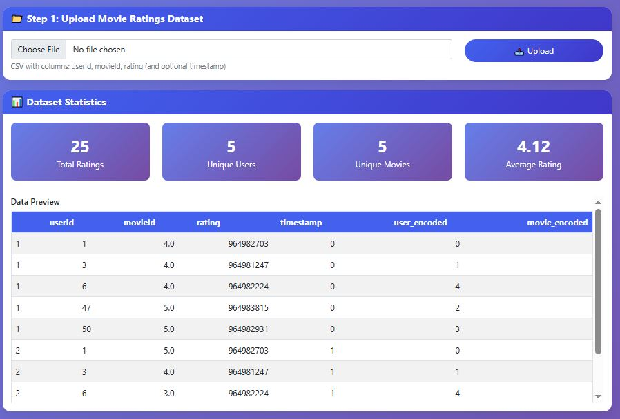
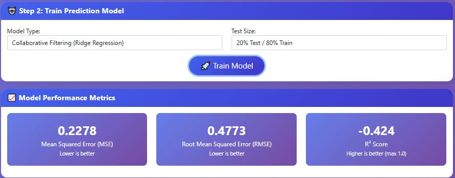
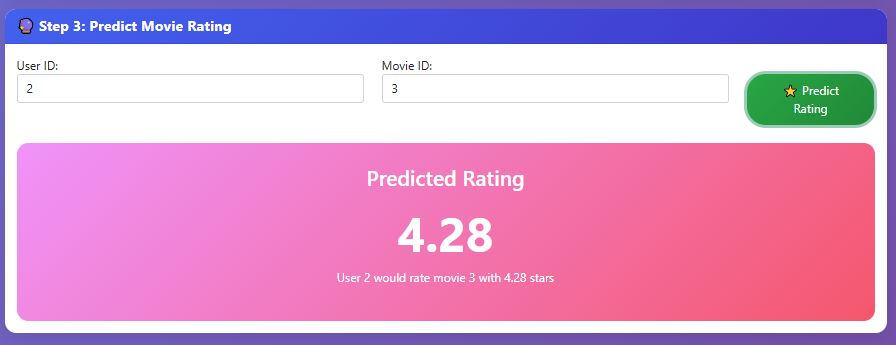
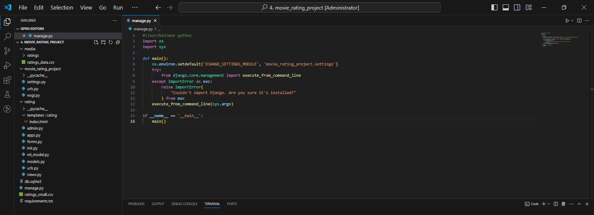

# 🎬 Movie Rating Prediction - Collaborative Filtering Project

[](https://www.python.org/)
[](https://www.djangoproject.com/)
[](https://scikit-learn.org/)
[](LICENSE)

A complete Machine Learning web application that predicts movie ratings using Collaborative Filtering and Regression models. Built with Django and deployed with a beautiful interactive interface.

---

## 📸 Project Screenshots

### 🖥️ Main GUI Interface
The main dashboard where users can upload movie ratings data and view predictions.



### 📊 Prediction Results
Real-time movie rating predictions with model performance metrics.



### 📈 Model Performance Analysis
Detailed analysis of model accuracy and performance metrics.



### 🎯 Final Prediction Output
Complete prediction results with user and movie information.



---

## 🏗️ Project Structure
Complete project structure for better understanding of the code organization.



---

## 📊 Project Overview

This project uses movie rating datasets to predict how a user might rate a movie they haven't seen yet using:

- **Collaborative Filtering**: Ridge Regression based approach
- **Regression Models**: Random Forest with engineered features
- **User-Item Matrix**: Sparse matrix factorization
- **Real-time Predictions**: Instant rating predictions

The application provides an interactive web interface where users can input user ID and movie ID to get predicted ratings.

---

## 🎯 Features

- ✅ **Data Upload**: Support for CSV files with ratings data
- ✅ **Multiple Models**: Collaborative Filtering & Regression
- ✅ **User-Item Encoding**: Label encoding for users and movies
- ✅ **Feature Engineering**: User averages, movie averages, rating counts
- ✅ **Model Evaluation**: MSE, RMSE, R² Score metrics
- ✅ **Real-time Predictions**: Instant rating predictions
- ✅ **Dataset Statistics**: Total ratings, unique users, unique movies
- ✅ **Responsive Design**: Works on all devices

---


---

## 🚀 Installation & Setup

### Prerequisites

- Python 3.9 or higher
- pip package manager

### Step-by-Step Installation

1. **Download the Project**
   - Download [4. movie_rating_project.rar](4.%20movie_rating_project.rar)
   - Extract the files to your desired location

2. **Create a virtual environment**
```bash
# Windows
python -m venv venv
venv\Scripts\activate

# Linux/Mac
python3 -m venv venv
source venv/bin/activate
